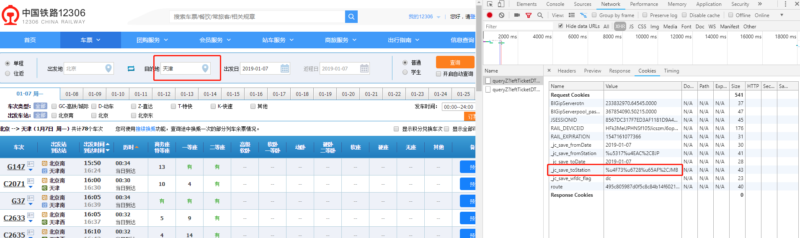

## rob_12306_fuck

抢票软件

### 环境安装

GoogleDriver

下载对应系统版本
    
    https://sites.google.com/a/chromium.org/chromedriver/downloads
    
    mac:
    mv chromedriver /usr/local/bin
    
    linux:
    mv chromedriver /usr/bin
    
    window:
    放入 python site-script 目录中    

    
### 旅客信息

在 conf/12306.conf 中配置
城市信息在 city.conf 中配置

在12306网站中找到你想去的城市，在配置文件中进行配置
注意：% 要 变成两个 %%
    
    tj=%%u5929%%u6D25%%2CTJP
    
### 项目启动

在控制台输入需要启动的配置

conf/12306.conf 配置中 passenger的下标 从0开始

### 关于赞助

如果觉得这个项目对你有帮助，有工程或者视野上的启发，

本着自愿原则进行赞助 

